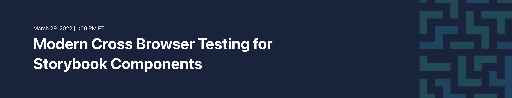

# Modern Cross Browser Testing for Storybook Components

This repository contains a demo project for visually testing
[Storybook](https://storybook.js.org/) components
in a [React](https://reactjs.org/) front-end app
with [Applitools Eyes](https://applitools.com/products-eyes/).
Applitools Eyes will perform visual tests on Storybook components
*without* the need to write any extra test code!

This project was created for the
[Modern Cross Browser Testing for Storybook Components](http://applitools.info/vbm) workshop
led by [Pandy Knight](https://twitter.com/AutomationPanda)
and hosted by [Applitools](https://applitools.com/).
The workshop abstract is provided in [`ABSTRACT.md`](ABSTRACT.md).
Full instructions for the workshop are provided in [`WORKSHOP.md`](WORKSHOP.md).


## Outline

1. Understanding our React app
2. Manually testing Storybook components
3. Visually testing Storybook components
4. Testing components across different browsers


## Prerequisites

1. An Applitools account (Register [here](https://auth.applitools.com/users/register) for a free account)
2. [Node.js](https://nodejs.org/en/) (This project was created with v16.13.1)
3. A JavaScript IDE like [Visual Studio Code](https://code.visualstudio.com/docs/languages/javascript)
4. Up-to-date versions of your favorite web browsers.


## Quickstart

To **clone this repository**:

```bash
git clone https://github.com/applitools/workshop-cbt-storybook.git
```

To **install the dependencies**:

```bash
cd applitools-react-storybook-demo
npm install
```

> *Note:*
> This project was initially created using
> [Create React App](https://github.com/facebook/create-react-app).

To **launch the React app**, run:

```bash
npm start
```

This command starts the app at `http://localhost:3000/`.
When it loads, you should see the home page,
which concisely explains the need for visual component testing.

To **launch the Storybook viewer**, run:

```bash
npm run storybook
```

This command starts the viewer at `http://localhost:6006/`.
When it loads, you should see components on the left navbar,
and the main part of the page should be a component viewer.

To **launch visual tests using Applitools**,
set the `APPLITOOLS_API_KEY` environment variable to your secret API key,
and then run:

```bash
npx eyes-storybook
```

Visual test results will appear in the Applitools dashboard.
