# Workshop Walkthrough

This guide provides a full written walkthrough for visually testing
[Storybook](https://storybook.js.org/) components
in a [React](https://reactjs.org/) front-end app
with [Applitools Eyes](https://applitools.com/products-eyes/).
Applitools Eyes will perform visual tests on Storybook components
*without* the need to write any extra test code!
Follow along with the instructions below to try it for yourself.
You'll need Node.js, an editor, and an Applitools account.


## Understanding our React app

This repository contains a fully working React app with Storybook components.
In fact, its home page contains a brief slideshow explaining *why* components should be visually tested.
Let's run the app and walk through it together.

First, **clone this repository** to your local machine:

```bash
git clone https://github.com/applitools/workshop-cbt-storybook.git
```

Then, **install the dependencies** using `npm`:

```bash
cd applitools-react-storybook-demo
npm install
```

> *Note:*
> This project was initially created using
> [Create React App](https://github.com/facebook/create-react-app).

Finally, **launch the React app**:

```bash
npm start
```

This command starts the app at `http://localhost:3000/`.
When it loads, you should see the home page:

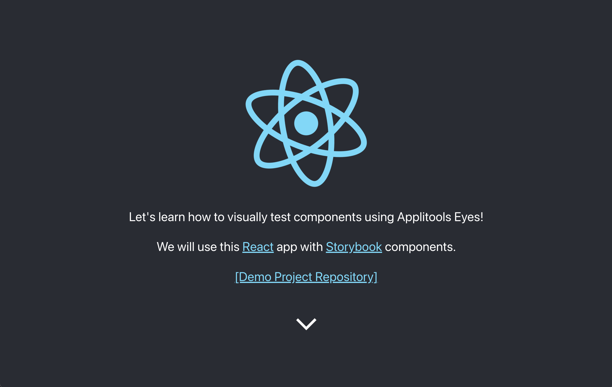

Click the down arrow to see the next slide:

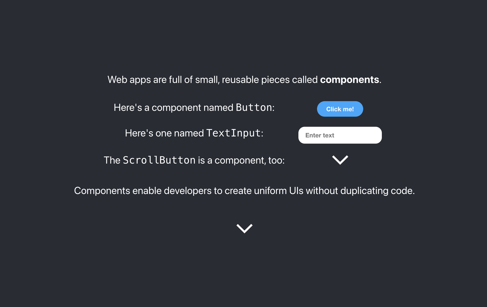

Web pages are made up of countless *elements* on each page.
Elements can be buttons, text fields, labels - anything!
In order to maintain consistent designs,
web developers create libraries of reusable components.
That way, they can reuse components anywhere in the app
without duplicating code or breaking uniformity.

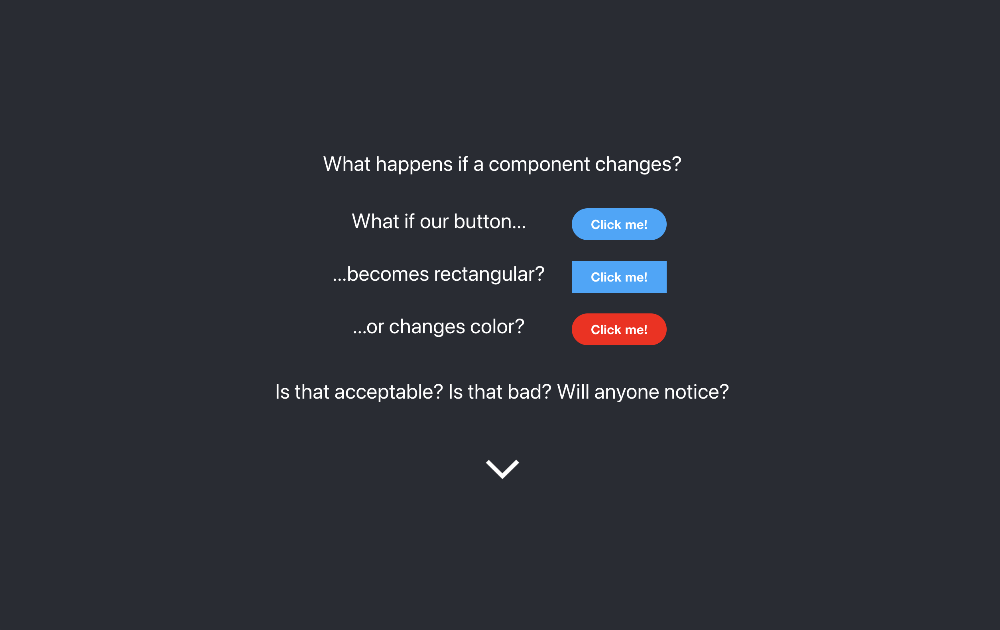

However, as developers develop web apps, they make changes to components. 
Some changes are intentional, but others are not.
What happens if a round blue button becomes rectangular, or turns red?
Is that good or bad?
Furthermore, will anyone notice?

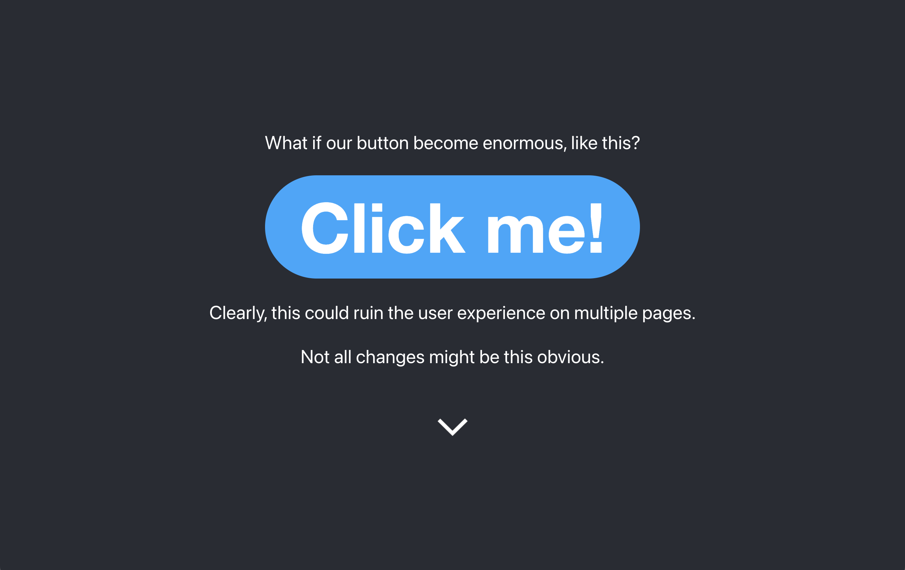

What if the button becomes enormous?
That would surely ruin the user interface (UI) *and* the user experience (UX) on multiple pages.
It would also be pretty obvious.
Not all changes might be this obvious, though.
Think about round buttons turning rectangular.

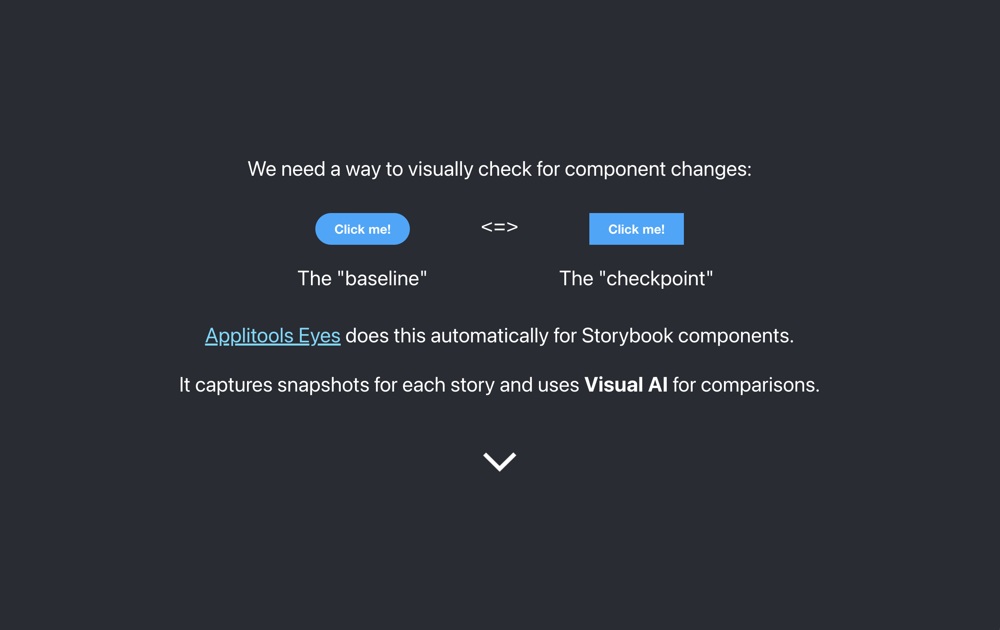

We need a way to visually inspect components.
If we could compare a good "baseline" image side-by-side with the latest "checkpoint" image,
then we could easily see any differences.
[Applitools Eyes](https://applitools.com/products-eyes/) does this automatically for Storybook components.
It captures snapshots for each story and uses
[Visual AI](https://applitools.com/applitools-ai-and-deep-learning/) for comparisons.
In fact, you don't even need to create any test cases or write any automation code:
The Applitools Eyes Storybook SDK automatically creates tests for each story it finds.

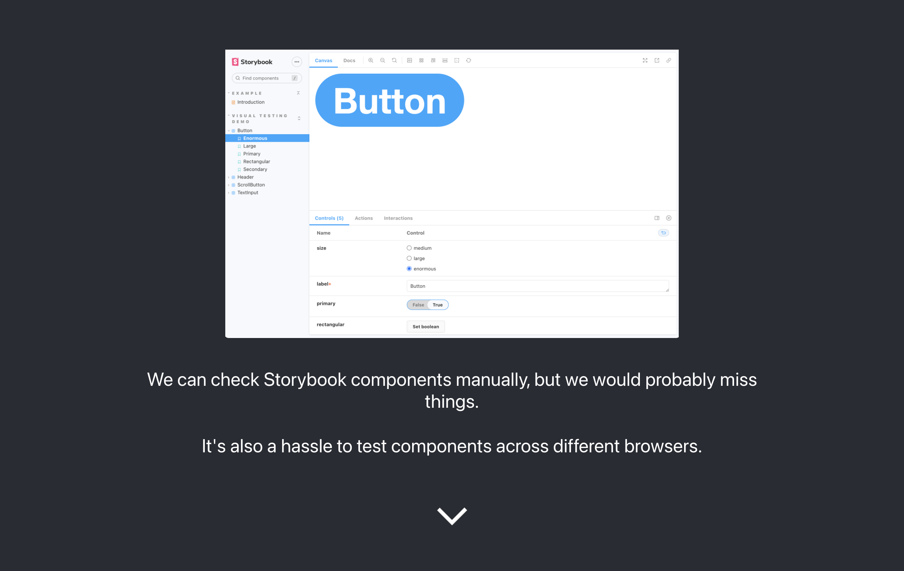

We *could* do this testing manually using the Storybook viewer,
but we would probably miss things.
Manual inspection would also be difficult to scale with a large component library.
It's also a hassle to do cross-browser testing for these components.

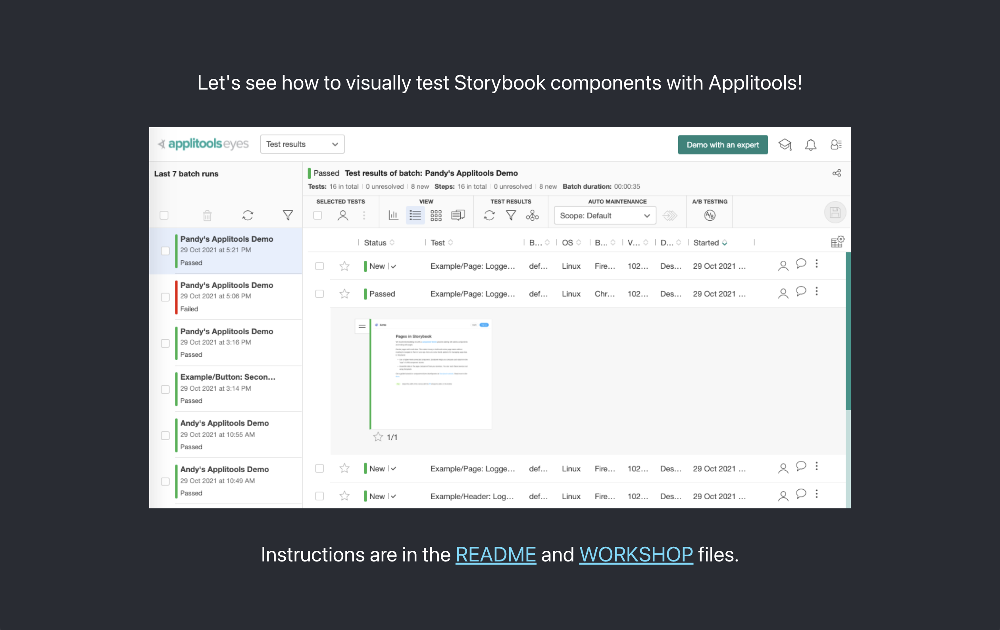

Let's take a closer look at the Storybook component library for this app,
and then we'll test the components visually using Applitools.


## Manually testing Storybook components

Launch the Storybook viewer like this:

```bash
npm run storybook
```

This command starts the viewer at `http://localhost:6006/`.
When it loads, you should see components on the left sidebar,
and the main part of the page should be a component viewer.

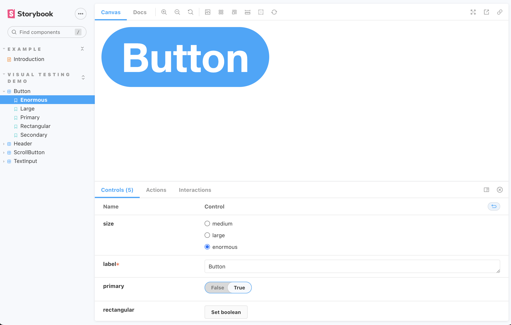

Our app has 4 components: `Button`, `Header`, `ScrollButton`, and `TextInput`.
Each one has multiple "stories," or ways to render it.
We can expand each component in the left sidebar to see all its stories.
We can also directly set different properties to twiddle aspects of each component.

Doing this manually while developing components is incredibly helpful
because it provides instant feedback for code changes.
However, inspecting every component manually for every change is very tedious.
Furthermore, opening the Storybook view in different browsers would multiply the tedium.
We need a more effective way to test the whole library.


## Preparing for visual testing

Applitools Eyes makes it easy to test all components visually.
To get started, you need an Applitools account.
You can [register a free Applitools account](https://auth.applitools.com/users/register)
using your email or GitHub account.

Then, you need to set your account's API key as an environment variable.
Applitools should have sent you an email with your API key when you created your account.
You can also access your API key through the Applitools dashboard.

On Windows:

```
set APPLITOOLS_API_KEY=<your-api-key>
```

On Linux or macOS:

```bash
export APPLITOOLS_API_KEY=<your-api-key>
```

Next, you need to add the
[eyes-storybook](https://www.npmjs.com/package/@applitools/eyes-storybook)
package to your project.
This package should have been installed when you ran `npm install` earlier.
However, if you want to install it in other projects, use the following command:

```bash
npm install --save-dev @applitools/eyes-storybook
```

Finally, you should configure Applitools configurations in a file named `applitools.config.js`.
For example, you might want to set `batchName` to a descriptive name for your test suite,
since this name will appear in the Applitools dashboard.
The [npm package page](https://www.npmjs.com/package/@applitools/eyes-storybook)
provides documentation on `applitools.config.js` settings under the
[Advanced configuration](https://www.npmjs.com/package/@applitools/eyes-storybook#advanced-configuration)
section.

This project already has `applitools.config.js`.
For our first visual tests,
overwrite its contents with the following:

```javascript
module.exports = {
  concurrency: 1,
  batchName: "Visually Testing Storybook Components"
}
```

Now, we are ready to start running visual tests!


## Visually testing Storybook components

The first step in visual component testing is creating a set of *baseline* snapshots for each component.
The baseline images represent the "good" or "proper" visual state for the components.
When visual component tests run in the future,
they will compare the baselines to new snapshots to detect any changes.

Capture baselines by running the visual tests with this command:

```bash
npx eyes-storybook -s public
```

> The `-s public` option sets the static directory path.
> If this is not set, then visual tests for `ScrollButton` will not work
> because they need access to `public/white-down-arrow.png`.

In the console output, you should see the tests discover all Storybook stories
and capture "New" results for each.
When you log into the [Applitools dashboard](https://eyes.applitools.com/),
You should see a new test batch with snapshots for all components.
The status of each test should say "New" here, too.

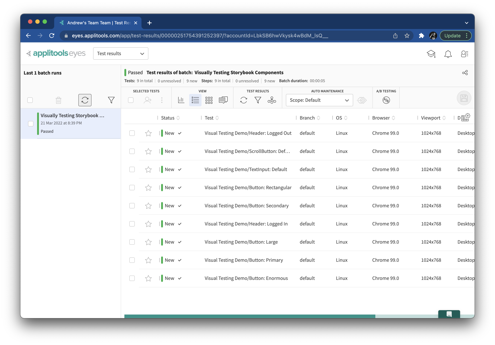

Once baselines are captured, you can run *checkpoint* tests for each component.
Rerun the visual tests again without making any changes.
Use the same command to launch tests:

```
npx eyes-storybook -s public
```

Now, the console output and the new batch in the dashboard should say "Passed" instead of "New" for each story.
Each test result in the dashboard can also be manually inspected next to the baseline.

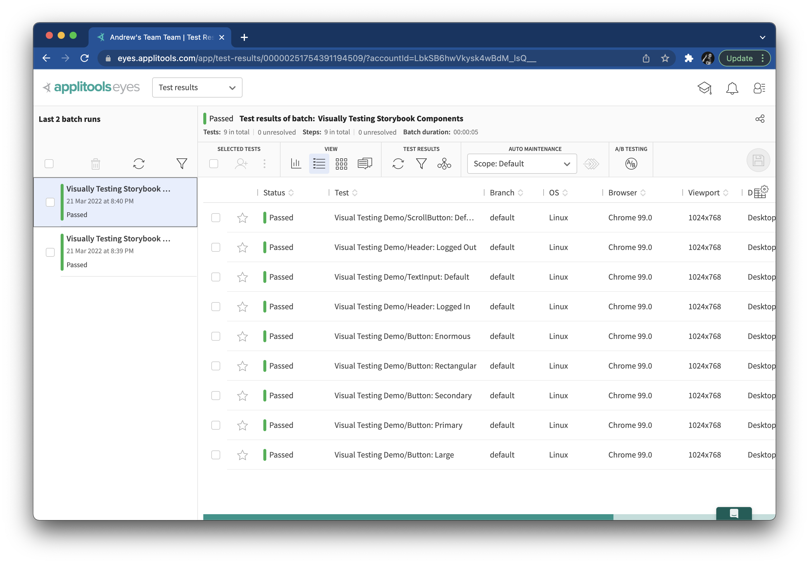

Let's make a change to one of the components.
In `src/stories/button.css`, change this:

```css
.storybook-button--primary {
  color: white;
  background-color: #1ea7fd;
}
```

To this:

```css
.storybook-button--primary {
  color: white;
  background-color: #f80606;
}
```

Save the file, and rerun the visual tests.
This time, Applitools Eyes detects that a few components are different!
These tests are marked as "Unresolved" because someone needs to decide if they are okay or not okay.
You can log into the dashboard to see the changes firsthand: blue buttons became red.
You can then decide if they are okay ("thumbs-up") or not okay ("thumbs-down").

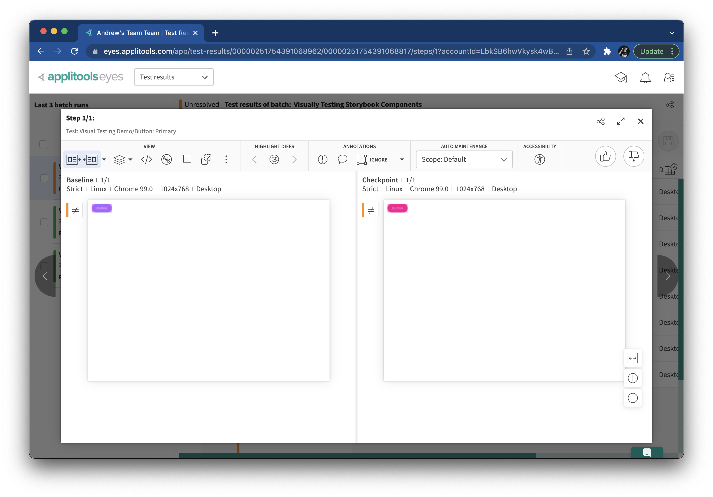

While comparing snapshots, go to "View" and select "Preview match level".
The default setting is "Strict", which aims to detect changes as a human eye would see.
Under this setting, the whole button should be highlighted.
However, if you change it to "Content", then the highlighting disappears.
"Content" is like "Strict" but ignores color and small stylistic difference.
If you change it to "Layout", the highlighting also disappears,
because "Layout" looks for changes in element positions relative to each other.
You can use different match levels to help determine if changes are okay.

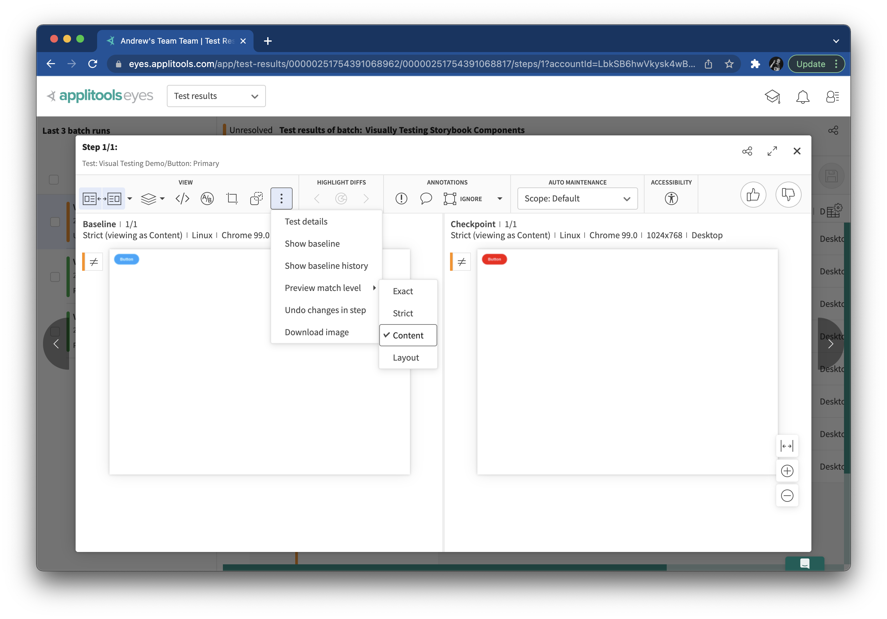

Let's say this change is okay.
Mark the "Unresolved" tests as "Passed" by clicking the thumbs-up icon.
Save the changes in the dashboard.
This will save new baselines.
Rerun the tests, and they should pass again.

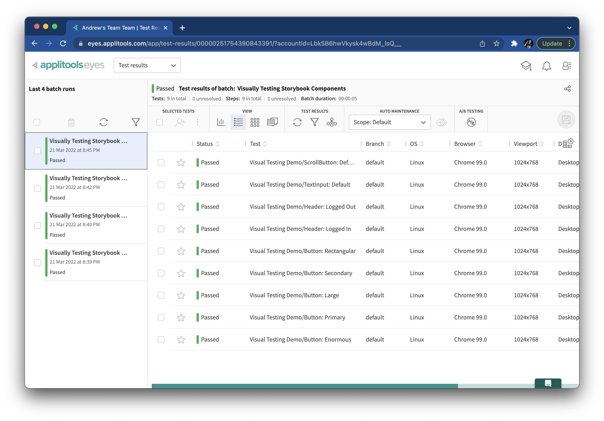

Some components are more complex than others.
Changes in content might be okay, while changes in layout might be problematic.
Let's make a change to the `Header` component.
In `src/stories/Header.jsx`, change this:

```javascript
<h1>Visually Testing Storybook Components</h1>
```

To this:

```javascript
<h1>My Cool Site</h1>
```

Also, in `src/stories/header.css`, remove this line:

```css
justify-content: space-between;
```

Save the file, and rerun the visual tests.
Again, Applitools Eyes detects differences and marks them "Unresolved".

In the Applitools dashboard, open the results for one of the `Header` stories.
Compare the latest snapshot to the baseline.
Applitools should highlight the titles and buttons ans different.
Change the match level from "Strict" to "Content" and "Layout" again.
This time, "Content" still highlights almost as much difference as "Strict"
because the header changed a lot.
"Layout", however, only highlights buttons because it ignores the word change.

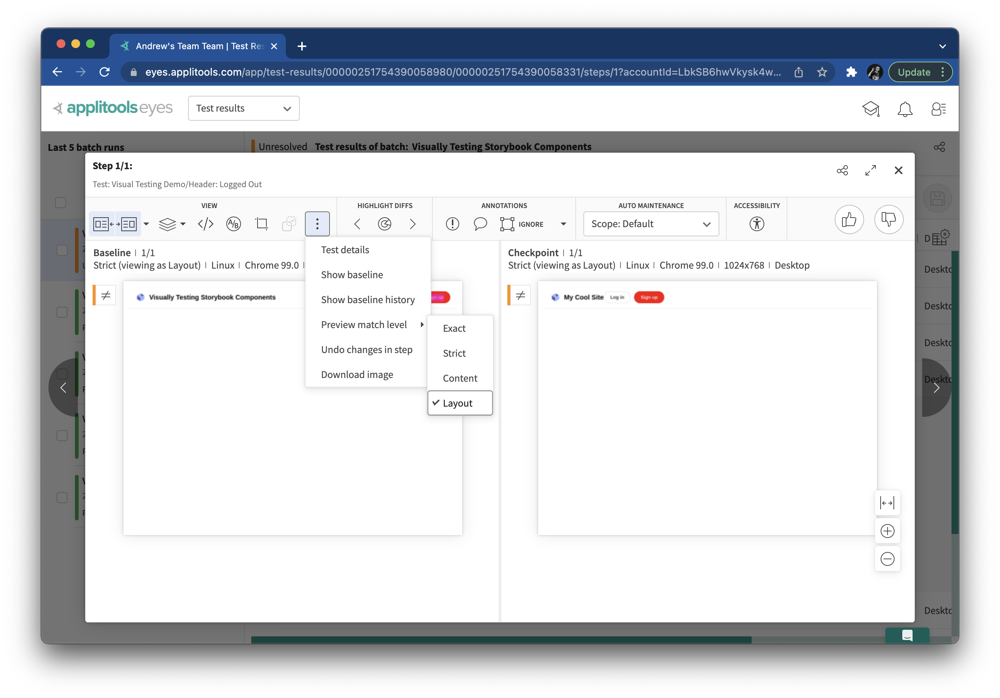

Let's say these changes are *not* okay.
Mark the "Unresolved" tests as "Failed" by clicking the thumbs-down icon.
Save the changes in the dashboard.
Then, undo the code changes, rerun the tests, and make sure things pass.

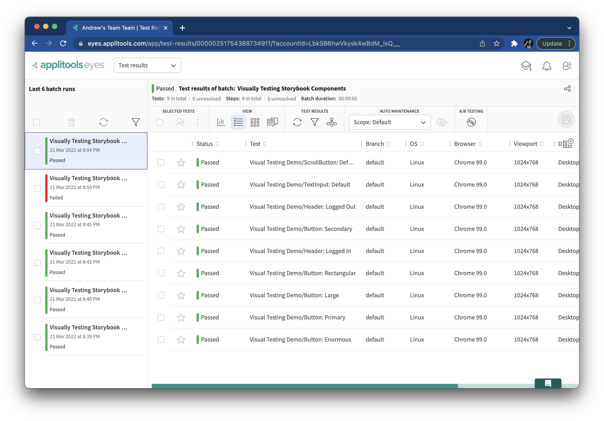


## Testing components across different browsers

So far, all our visual tests have run against Google Chrome.
Applitools makes it easy to run visual component tests against *any* browser
using [Applitools Ultrafast Grid](https://applitools.com/docs/topics/overview/using-the-ultrafast-grid.html).
All you need to do is add browser configs to `applitools.config.js`.

Let's cover 5 desktop browsers and 5 mobile browsers.
Overwrite `applitools.config.js` with the following content:

```javascript
module.exports = {
  concurrency: 1,
  batchName: "Visually Testing Storybook Components",
  browser: [
    // Desktop
    {width: 800, height: 600, name: 'chrome'},
    {width: 700, height: 500, name: 'firefox'},
    {width: 1600, height: 1200, name: 'ie11'},
    {width: 1024, height: 768, name: 'edgechromium'},
    {width: 800, height: 600, name: 'safari'},
    // Mobile
    {deviceName: 'iPhone X', screenOrientation: 'portrait'},
    {deviceName: 'Pixel 2', screenOrientation: 'portrait'},
    {deviceName: 'Galaxy S5', screenOrientation: 'portrait'},
    {deviceName: 'Nexus 10', screenOrientation: 'portrait'},
    {deviceName: 'iPad Pro', screenOrientation: 'landscape'},
  ]
}
```

The desktop browser configs include width and height viewport sizes,
while mobile devices require device names and screen orientations.

> *Note:*
> If you have a free account,
> then your concurrency will be limited to 1.

Run the visual tests again.
They will take a little longer than before.
Once finished, you will see that the Applitools Dashboard has several new baselines
for a total of 90 tests.

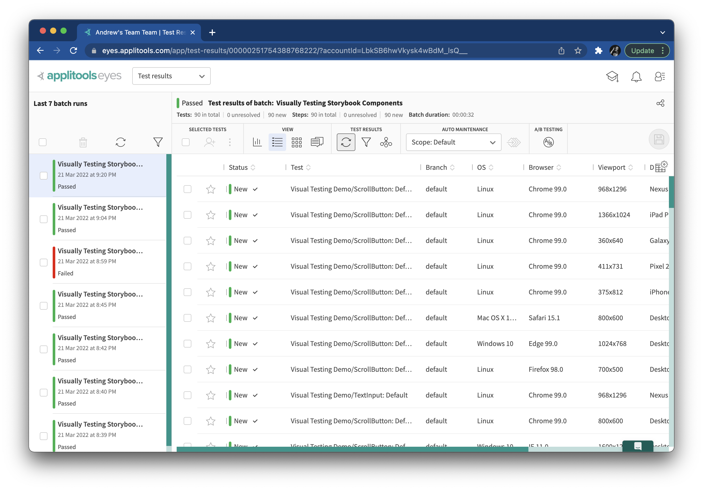

Notice also how quickly the Ultrafast Grid ran these test: 90 tests in 32 seconds.
That's *way* faster than traditional cross-browser testing platforms!
The only "code" you had to write was a configuration file, too!