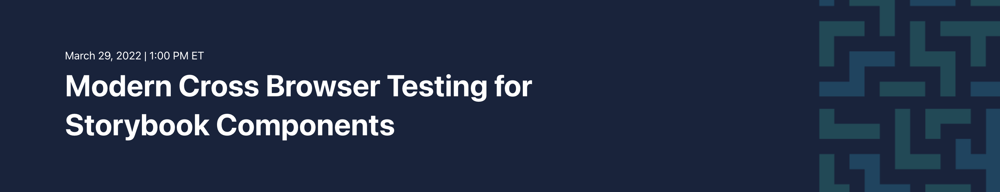

# Workshop Walkthrough

This guide provides a full written walkthrough for visually testing
[Storybook](https://storybook.js.org/) components
in a [React](https://reactjs.org/) front-end app
with [Applitools Eyes](https://applitools.com/products-eyes/).
Applitools Eyes will perform visual tests on Storybook components
*without* the need to write any extra test code!
Follow along with the instructions below to try it for yourself.
You'll need Node.js, an editor, and an Applitools account.


## Understanding our React app

This repository contains a fully working React app with Storybook components.
In fact, its home page contains a brief slideshow explaining *why* components should be visually tested.
Let's run the app and walk through it together.

First, **clone this repository** to your local machine:

```bash
git clone https://github.com/applitools/workshop-cbt-storybook.git
```

Then, **install the dependencies** using `npm`:

```bash
cd applitools-react-storybook-demo
npm install
```

> *Note:*
> This project was initially created using
> [Create React App](https://github.com/facebook/create-react-app).

Finally, **launch the React app**:

```bash
npm start
```

This command starts the app at `http://localhost:3000/`.
When it loads, you should see the home page:


Click the down arrow to see the next slide:


Web pages are made up of countless *elements* on each page.
Elements can be buttons, text fields, labels - anything!
In order to maintain consistent designs,
web developers create libraries of reusable components.
That way, they can reuse components anywhere in the app
without duplicating code or breaking uniformity.


However, as developers develop web apps, they make changes to components. 
Some changes are intentional, but others are not.
What happens if a round blue button becomes rectangular, or turns red?
Is that good or bad?
Furthermore, will anyone notice?


What if the button becomes enormous?
That would surely ruin the user interface (UI) *and* the user experience (UX) on multiple pages.
It would also be pretty obvious.
Not all changes might be this obvious, though.
Think about round buttons turning rectangular.


We need a way to visually inspect components.
If we could compare a good "baseline" image side-by-side with the latest "checkpoint" image,
then we could easily see any differences.
[Applitools Eyes](https://applitools.com/products-eyes/) does this automatically for Storybook components.
It captures snapshots for each story and uses
[Visual AI](https://applitools.com/applitools-ai-and-deep-learning/) for comparisons.
In fact, you don't even need to create any test cases or write any automation code:
The Applitools Eyes Storybook SDK automatically creates tests for each story it finds.


We *could* do this testing manually using the Storybook viewer,
but we would probably miss things.
Manual inspection would also be difficult to scale with a large component library.
It's also a hassle to do cross-browser testing for these components.


Let's take a closer look at the Storybook component library for this app,
and then we'll test the components visually using Applitools.


## Manually testing Storybook components

TBD


## Visually testing Storybook components

TBD


## Testing components across different browsers

TBD
